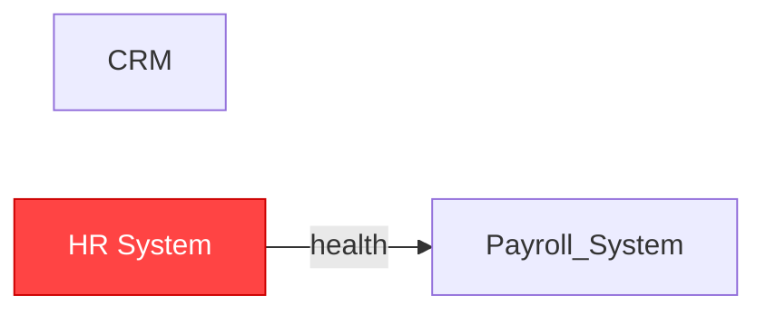

# data-inventory-mapper

Reads a structured data inventory CSV and produces a Mermaid data flow diagram plus a comprehensive markdown summary. Highlights Special Category data (GDPR Article 9), missing legal bases, and retention coverage.

## Requirements

```
python-dotenv
```

## Usage

### Both diagram and summary (default)
```bash
python main.py --inventory sample_input/data_inventory.csv
```

### Mermaid diagram only
```bash
python main.py --inventory sample_input/data_inventory.csv --output mermaid
```

### Markdown summary only
```bash
python main.py --inventory sample_input/data_inventory.csv --output markdown
```

## CSV Format

Required columns: `system,data_type,classification,location,transfers_to,legal_basis,retention_period`

```csv
system,data_type,classification,location,transfers_to,legal_basis,retention_period
CRM,contact_details,Confidential,On-premise,Email Platform,legitimate_interests,3 years
HR System,health,Special_Category,Cloud (Azure),Payroll System,legal_obligation,7 years
```

## Classification Levels

`Public` | `Internal` | `Confidential` | `Restricted` | `Special_Category`

## Special Category Detection

Automatically flags records containing: health, medical, biometric, genetic, racial/ethnic origin, political opinions, religious beliefs, sexual orientation, criminal records, financial data, or children's data.

## Sample Output

```markdown
## Data Flow Diagram



## Data Inventory by Classification

### Special_Category (2 records)

| System | Data Type | Location | Legal Basis | Retention |
|--------|-----------|----------|-------------|-----------|
| **HR System** 🔴 | health | Cloud (Azure) | legal_obligation | 7 years |
```
